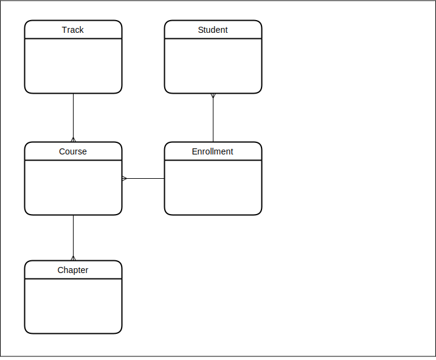

# Sir learn a lot

GraphQl API and single table DynamoDb data store for an online learning platform.

<p float="left">
  
   
</p>

- [Requirements](#requirements)
- [Environment setup](#environment-setup)
- [Local development](#local-development)
- [AWS commands](#aws-commands)
- [Table design](#table-design)
  - [ERD](#erd)
  - [Access patterns](#access-patterns)
  - [Key prefixes](#key-prefixes)

## Requirements

- [docker](https://www.docker.com/)
- [localstack](https://localstack.cloud/)
- [awslocal](https://github.com/localstack/awscli-local)

## Environment setup

```bash
yarn local:up

# tear down localstack docker container
yarn local:down
```

truncate the dynamo table

```bash
yarn purge
```

## Local development

```bash
yarn dev
```

[GraphiQl running on localhost port 3000](http://localhost:3000/graphql)

## AWS commands

```bash
awslocal dynamodb scan --table-name sir-learn-a-lot
awslocal dynamodb scan --table-name sir-learn-a-lot --index-name gsi1
awslocal dynamodb scan --table-name sir-learn-a-lot --index-name gsi2
```

## Table design

### ERD



### Access patterns

- get course by id
- get course by track id (gsi1)
- get enrollment by id
- get student by id
- get track by id

### Key prefixes

- `c#` = course
- `s#` = student
- `t#` = track
- `e#` = enrollment
