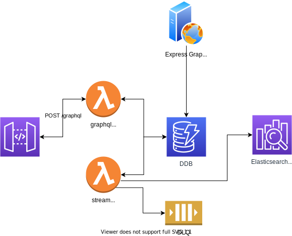
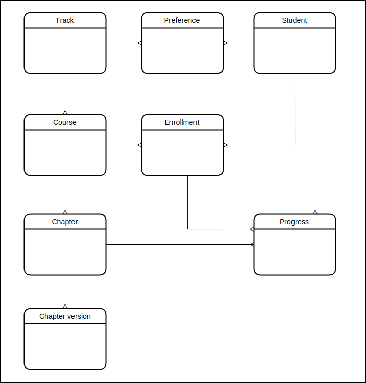
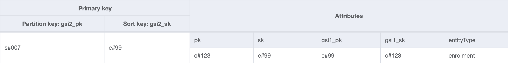

# Sir learn a lot

Lambda GraphQl API with a single table DynamoDb data store for an online learning platform.
This project is a _proof of concept_ only and therefore has no unit tests.

<p float="left">
   
  
   
</p>

- [References](#references)
- [Prerequisites](#prerequisites)
- [Architecture](#architecture)
- [Environment setup](#environment-setup)
- [Local development](#local-development)
- [AWS commands](#aws-commands)
- [Table design](#table-design)
  - [ERD](#erd)
  - [Key prefixes](#key-prefixes)
  - [Indexes](#indexes)
  - [Access patterns](#access-patterns)
- [NoSQL single table design theory](#nosql-single-table-design-theory)
- [DynamoDB tips and tricks](#dynamodb-tips-and-tricks)
- [Known issues](#known-issues)

## References

This work is largely taken from and inspired by the following sources from [Rick Houlihan](https://www.linkedin.com/in/rickhoulihan) and [Alex DeBrie](https://www.linkedin.com/in/alex-debrie):

- [Fundamentals of Amazon DynamoDB Single Table Design with Rick Houlihan](https://www.youtube.com/watch?v=KYy8X8t4MB8&t=0)
- [AWS re:Invent 2018: Amazon DynamoDB Deep Dive: Advanced Design Patterns for DynamoDB](https://www.youtube.com/watch?v=HaEPXoXVf2k)
- [amazon-dynamodb-design-patterns](https://github.com/aws-samples/amazon-dynamodb-design-patterns)
- [Single-Table Design with DynamoDB - Alex DeBrie, AWS Data Hero](https://youtu.be/BnDKD_Zv0og?t=0)
- [https://www.alexdebrie.com/](https://www.alexdebrie.com/)

## Prerequisites

- [docker](https://www.docker.com/)
- [localstack](https://localstack.cloud/)
- [awslocal](https://github.com/localstack/awscli-local)
- [Node version manager](https://github.com/nvm-sh/nvm)

### Architecture

A single `apollo-server-lambda` lambda hosts the GraphQL `POST` route `/graphql` (for more details [see npm package](https://www.npmjs.com/package/apollo-server-lambda)). A second lambda is listening to the DynamoDB stream in order to atomically update the users xp score as progress is made in the various chapters. The majority of the repository code (which is the most complex code) is boilerplate / formulaic so could be converted into its own DynamoDB single table library but this task is deferred for the scope of this POC. The rest of the code is simple types and GraphQL queries and mutation logic constructed using `type-graphql` then allowing GraphQL and DynamoDB to work their magic! Combined with Lambda this solution represents a high scalable, elastic, dynamic service.



## Environment setup

```bash
# use the correct version of node
nvm use

# install dependencies
yarn

# fire up localstack infrastructure (DynamoDB and table definition)
yarn local:up

# seed the database with some random data
yarn seed
```

```bash
# purge all the data from the DynamoDB table
yarn purge

# tear down localstack docker container
yarn local:down
```

## Local development

```bash
# start serverless offline lambdas
yarn dev
```

[GraphiQl running on localhost port 9000](http://localhost:9000/graphql)

Explore the full database content:

```
query exploreDb {
  getTracks {
    id
    name
    courses {
      id
      name
      chapters {
        id
        content
      }
      enrollments {
        id
        progress {
          xp
          marker
        }
        student {
          id
          firstName
          lastName
          email
          preferences {
            track {
              id
              name
            }
          }
        }
      }
    }
  }
}
```

## AWS commands

```bash
# dynamodb streams
awslocal dynamodbstreams list-streams

# dynamodb
awslocal dynamodb list-tables
awslocal dynamodb scan --table-name sir-learn-a-lot
awslocal dynamodb scan --table-name sir-learn-a-lot --index-name gsi1
awslocal dynamodb scan --table-name sir-learn-a-lot --index-name gsi2

# sqs
awslocal sqs list-queues
awslocal sqs receive-message --queue-url "http://localhost:4566/queue/stream-dlq" --max-number-of-messages 10
awslocal sqs delete-message --queue-url "http://localhost:4566/queue/stream-dlq" --receipt-handle <handle>
```

## Table design

### ERD



### Key prefixes

- `c#` = course
- `s#` = student
- `t#` = track
- `e#` = enrollment
- `p#` = preference
- `h#` = chapter
- `g#` = progress

### Indexes

Generated using [NoSQL Workbench](https://docs.aws.amazon.com/amazondynamodb/latest/developerguide/workbench.html). A JSON format export is [available here](./design/nosqlWorkbench.json)




### Access patterns

- get all tracks (gsi1)
- get track by id
- get course by id
- get course by track id (gsi1)
- get enrollment by id (gsi1)
- get enrollments by course
- get enrollments by student (gsi2)
- get student by id
- get student by email (gsi1)
- get track preferences by student
- get chapters by id (gsi1)
- get chapter by id and version (gsi1)
- get chapters by course
- get progress by enrollment id (gsi1)

## NoSQL single table design theory

The single table design patterns used in this project apply to all NoSQL databases and are not specific to DynamoDB. NoSQL is not a replacement for relational models, both still have their place to be used in the correct situations.

#### When should we use NoSQL?

- [OLTP](https://en.wikipedia.org/wiki/Online_transaction_processing)
- well known data access patterns
- need to scale horizontally, e.g. large global access patterns

#### When should we use SQL ?

- [OLAP](https://en.wikipedia.org/wiki/Online_analytical_processing)
- ad hoc queries

#### Characteristics of a NoSQL database

- de-normalized data does not make efficient use of storage because storage is one of the cheapest data center components
- queries minimize and efficiently make use of CPU (no complex joins) because CPU is one of the most expensive data center components
- not good at reshaping the data
- not suitable for ad hoc queries
- consistent, predictable performance at scale
- scales horizontally
- the data in a NoSQL is still **relational** (otherwise we would probably just put it in S3!!!)

#### NoSQL anti patterns

We should not use a NoSQL database with multiple tables to model relational data:

- inefficient
  - provision multiple tables
  - requires multiple reads and multiple writes (high latency)
  - requires complex transactional code (available in DynamoDB) and testing to manage insert / updates / delete
- requires manually stitching data together at application layer (emulating a relational database)
- adds complexity for backups and disaster recovery
- complicates local development
- does not scale (multiple reads across tables = high latency)
- fundamentally not what NoSQL databases were designed for (no joins, no referential integrity, no foreign keys)
- just use a relational db!

#### NoSQL single table design pattern

- serverless
- cheap
- fail fast
- prove the application before you pay for it
- streams + lambda act as database triggers allowing you to atomically write aggregate data back into the database in a process outside of the database

## DynamoDB tips and tricks

- **always** develop locally first using localstack or DynamoDB local. Avoid pain and long feedback loops with outcomes that are tricky to debug
- watch the videos in the [references section](#references) from Rick and Alex multiple times until the penny finally drops!
- use [NoSQL workbench](https://docs.aws.amazon.com/amazondynamodb/latest/developerguide/workbench.html) for modelling data and indexes
- don't store large documents
- use indexes to replace joins
- implement a layering of patterns and add additional indexes when necessary
- avoid [hot partitions](https://docs.aws.amazon.com/amazondynamodb/latest/developerguide/bp-partition-key-design.html)
- remember that GSI indexes also consume RCUs / WCUs and are potentially subject to throttling
- ensure your indexes distribute the data evenly across the table space
- use composite sort keys to model hierarchical relationships
- use data pointers to implement [number based versioning](https://aws.amazon.com/blogs/database/implementing-version-control-using-amazon-dynamodb/) (see chapter repository implementation and design)
- use [global tables](https://aws.amazon.com/dynamodb/global-tables/) for world wide domination of your app!
- use [TTL](https://docs.aws.amazon.com/amazondynamodb/latest/developerguide/TTL.html) to clear out stale data
- use [streams](https://docs.aws.amazon.com/amazondynamodb/latest/developerguide/Streams.html) + Lambda to implement database triggers (use an SQS DLQ to manage failed processes otherwise the stream will block infinitely)
- use [LSI](https://docs.aws.amazon.com/amazondynamodb/latest/developerguide/LSI.html) to resort the data within a partition and allow querying across different attributes
- only use [DAX](https://docs.aws.amazon.com/amazondynamodb/latest/developerguide/DAX.html) for **read intensive** applications
- understand how [partitions](https://docs.aws.amazon.com/amazondynamodb/latest/developerguide/HowItWorks.Partitions.html) work
- use SNS, SQS, Lambda and Dynamo to develop highly performant, scalable, elastic, asynchronous, decoupled micro-services
- use [elastic search with DynamoDB](https://aws.amazon.com/blogs/aws/new-logstash-plugin-search-dynamodb-content-using-elasticsearch/) for full text searching

## Known issues

- `serverless-offline-dynamodb-streams` is not always stable and can crash unexpectedly with `Unknown error`
