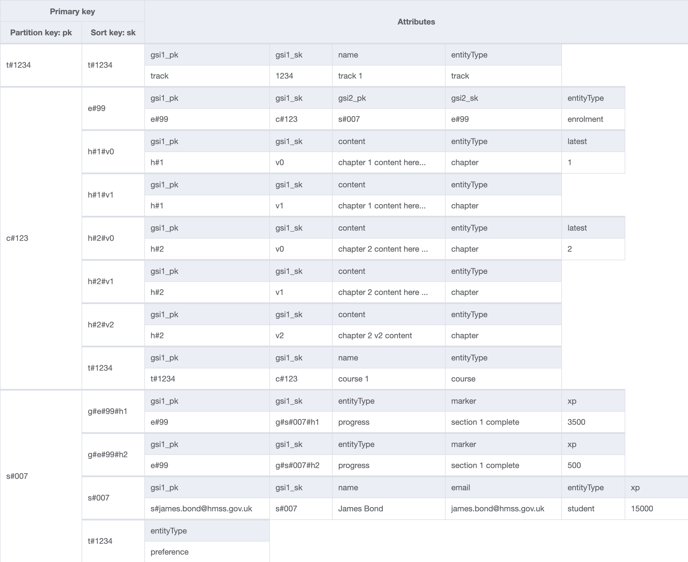
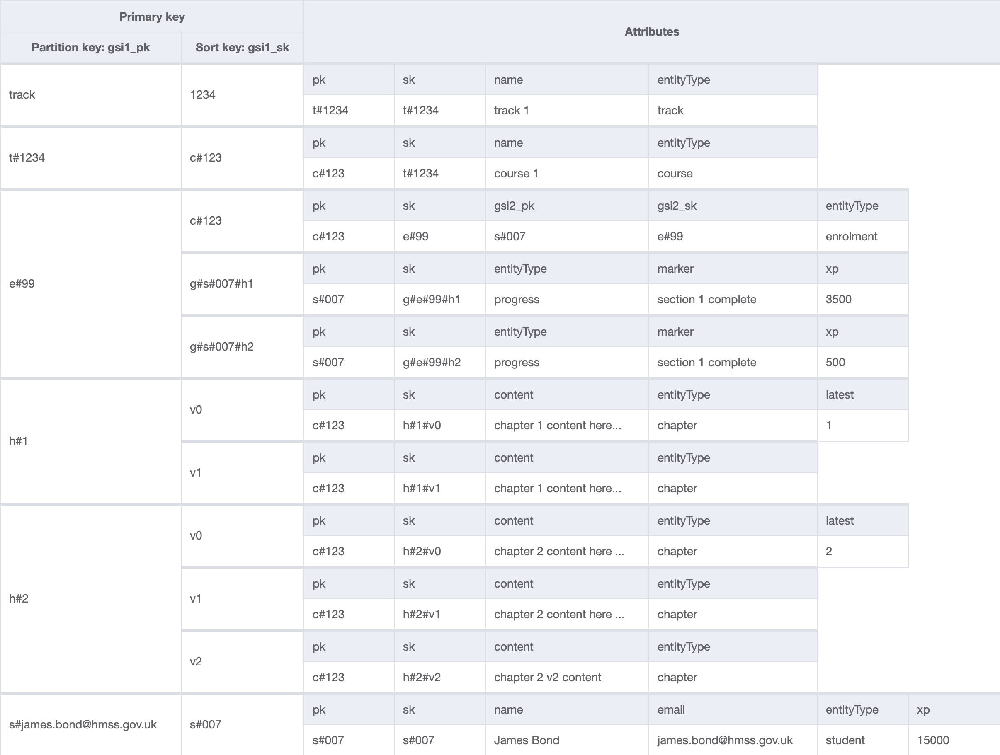

# Sir learn a lot

Lambda GraphQl API with a single table DynamoDb data store for an online learning platform.
This project is a _proof of concept_ only and therefore has no unit tests.

<p float="left">
   
  
   
</p>

- [Prerequisites](#prerequisites)
- [Environment setup](#environment-setup)
- [Local development](#local-development)
- [AWS commands](#aws-commands)
- [Table design](#table-design)
  - [ERD](#erd)
  - [Key prefixes](#key-prefixes)
  - [Indexes](#indexes)
  - [Access patterns](#access-patterns)

## Prerequisites

- [docker](https://www.docker.com/)
- [localstack](https://localstack.cloud/)
- [awslocal](https://github.com/localstack/awscli-local)

## Environment setup

```bash
yarn local:up

# tear down localstack docker container
yarn local:down
```

truncate the dynamo table

```bash
yarn purge
```

seed the database with random data

```bash
yarn seed
```

## Local development

```bash
yarn dev
```

[GraphiQl running on localhost port 3000](http://localhost:3000/graphql)

Explore the full database content:

```
query exploreDb {
  getTracks {
    id
    name
    courses {
      id
      name
      chapters {
        id
        content
      }
      enrollments {
        id
        progress {
          xp
          marker
        }
        student {
          id
          firstName
          lastName
          email
          preferences {
            track {
              id
              name
            }
          }
        }
      }
    }
  }
}
```

## AWS commands

```bash
awslocal dynamodb scan --table-name sir-learn-a-lot
awslocal dynamodb scan --table-name sir-learn-a-lot --index-name gsi1
awslocal dynamodb scan --table-name sir-learn-a-lot --index-name gsi2
```

## Table design

### ERD


### Key prefixes

- `c#` = course
- `s#` = student
- `t#` = track
- `e#` = enrollment
- `p#` = preference
- `h#` = chapter
- `g#` = progress

### Indexes

Generated using [NoSQL Workbench](https://docs.aws.amazon.com/amazondynamodb/latest/developerguide/workbench.html)






### Access patterns

- get all tracks (gsi1)
- get track by id
- get course by id
- get course by track id (gsi1)
- get enrollment by id (gsi1)
- get enrollments by course
- get enrollments by student (gsi2)
- get student by id
- get student by email (gsi1)
- get track preferences by student
- get chapters by id (gsi1)
- get chapters by course
- get progress by enrollment id (gsi1)
